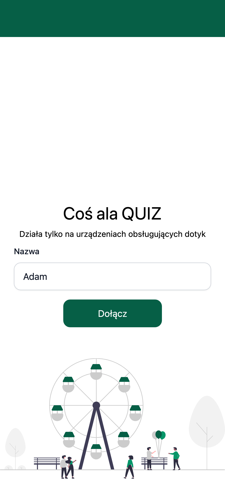
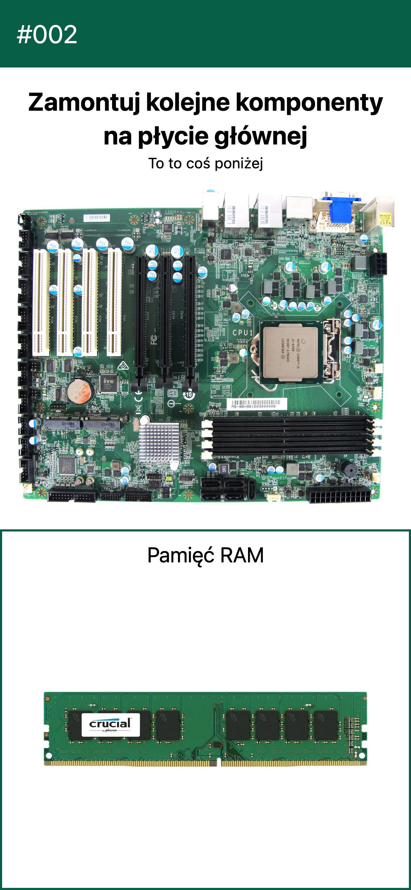
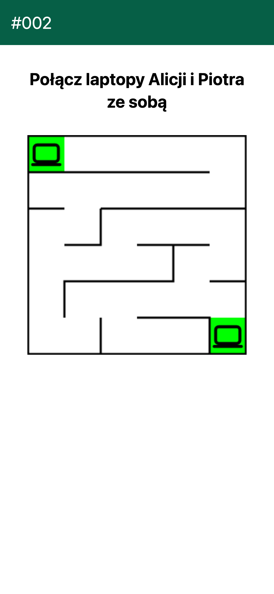
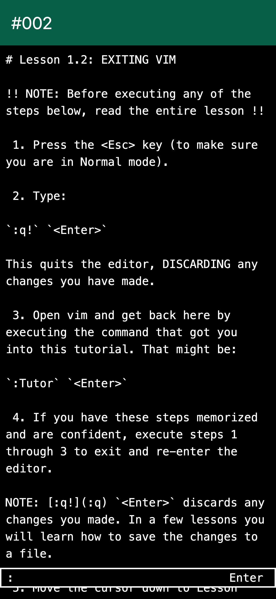
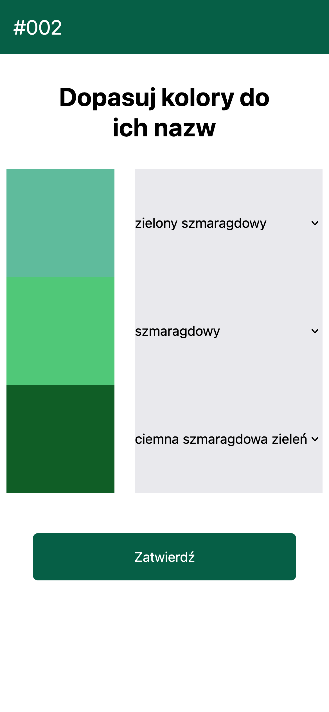
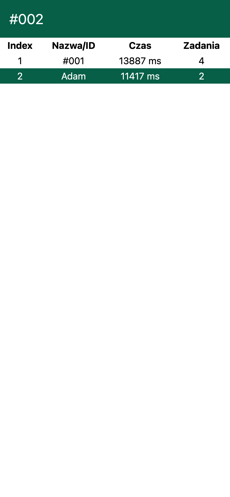

# Coś ala QUIZ

Program napisany w 4 wieczory z okazji Tygodnia Zawodowców w 2024.
Był używany aby urozmaicić przedstawianie kierunków w Zespole Szkół Łączności
i zaaktywizować osoby, które przyszły na prezentacje.








## Obsługa

Aby uruchomić kolejne zadanie należy wysłać zapytanie `GET /api/nextQuest`
na serwer.

## Wymagania

Aby zbudować program potrzebujemy [make](https://www.gnu.org/software/make/),
[go](https://go.dev/doc/install) w wersji conajmniej *1.22*,
[templ](https://templ.guide/quick-start/installation),
[sqlc](https://docs.sqlc.dev/en/latest/overview/install.html) oraz
[tailwind cli](https://tailwindcss.com/docs/installation). Jeżeli na komputerze
mamy zainstalowanego [nix-a](https://nixos.org/download/) możemy posłóżyć się
poniższym poleceniem, aby stworzyć shella z wymaganymi zależnościami programu.

```sh
nix-shell
```

## Budowanie

Przed zbudowaniem należy zainstalować wszystkie zależności.

Aby zbudować program należy posłużyć się poleceniem `make`, jak poniżej.
Domyślnie skompilowany program będzie miał nazwę *zsl-demo* i będzie działał
na porcie `8080`. Port można zmienić zapomocą zmiennej środowiskowej `PORT`.

```sh
# budowanie programu
make build
# uruchomienie programu
./zsl-demo
```

## Konfiguracja

Program można konfigurować za pomocą zmiennych środowiskowych. Akutalnie jest
obsługiwana jedna zmienna - `PORT`, która definiuje na jakim porcie będzie
dostępny serwer.

## Tunel cloudflare

Aplikacja jest banalnie prosta do udostępnienia online. Aby to zrobić
należy użyć jednego z poniższych poleceń.

```sh
# Jeżeli nie posiadamy domeny zarządzanej przez cloudflare
make free-tunnel
# Jeżeli posiadamy domenę zarządzaną przez cloudflare i chcemy jej użyć.
make login-tunnel
```

W przypadku pierwszego polecenia nasza aplikacja będzie dostępna pod losowym
adresem, np.: *https://washing-shaft-yr-design.trycloudflare.com*, który
znajdziemy w logach. Wygląda to mniej-więcej tak:

```
timestamp INF Requesting new quick Tunnel on trycloudflare.com...
timestamp INF +--------------------------------------------------------------------------------------------+
timestamp INF |  Your quick Tunnel has been created! Visit it at (it may take some time to be reachable):  |
timestamp INF |  https://washing-shaft-yr-design.trycloudflare.com                                         |
timestamp INF +--------------------------------------------------------------------------------------------+
```

W przypadku użycia drugiego polecenia należy ustawić zmienną środowiskową
`DNS_NAME` na adres wybranej subdomeny. Jeżli używamy innego portu niż *8080*,
trzeba też ustawić zmienną `PORT`. Możemy to też zrobić w pliku *Makefile*

